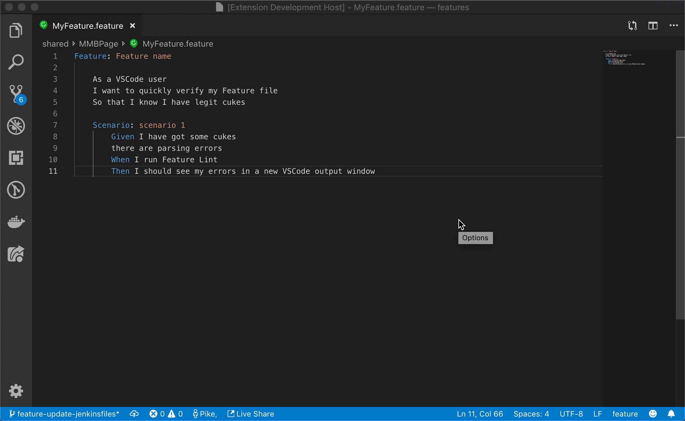

# Gherkin Feature Linter


## Features

Open any feature file (.feature extension) and validate it for syntax and parsablility.

* ```shift + ctrl + l``` 

* Context click your file editor window and select ```Feature Lint```

* ```Command Pallete > Feature Lint```

## Examples



